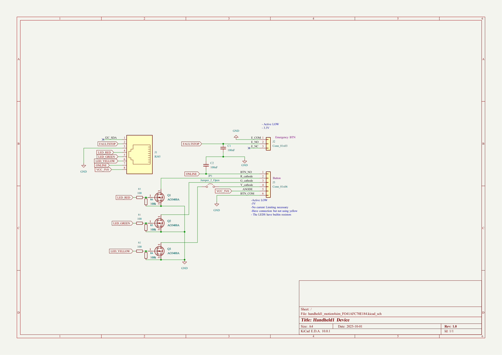
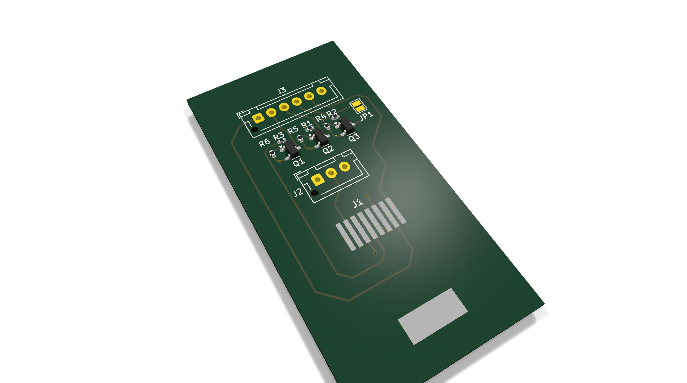
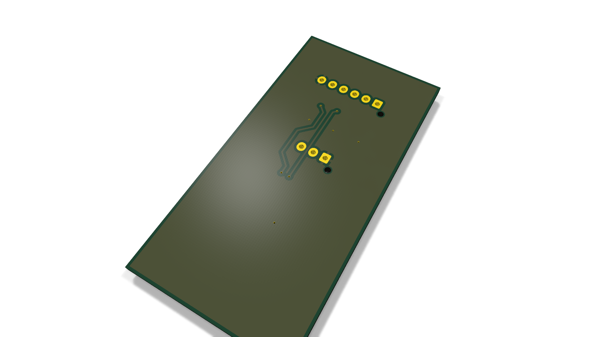

# handheld1_motion4sim_FO41AFC70E184

Handheld controller for Motio4sim motion-simulator with RJ45 link, emergency stop, and RGB online indicator

## At a Glance

- **Status**: Routed
- **Board size**: 30 x 60 mm
- **Layers**: 2
- **Components**: 13

## Schematic

Full PDF: [reports/schematic.pdf](reports/schematic.pdf)

## Component Roles

- **RJ45 connector** (J1) - tethers the handheld to the Motio4sim base unit over standard Ethernet cable (uses CAT cable but custom pin assignment, not actual Ethernet)
- **AO3400A** x3 (Q1-Q3) - 30 V, 5.7 A N-channel MOSFETs; switch the RGB indicator channels and act as level shifters for the I/O lines back to the base
- Emergency-stop momentary switch on the panel for cutting motion power
- RGB \"online\" status LED visible to the operator

## PCB

**Top copper**

**Bottom copper**

## Bill of Materials

| Refs | Value | Footprint | Qty | MPN | LCSC |
|------|-------|-----------|----:|-----|------|
| C1,C2 | 100nF |  | 2 |  |  |
| J1 | RJ45 | Connector_RJ:RJ45_Molex_0855135013_Vertical | 1 |  | [C708653](https://www.lcsc.com/product-detail/_C708653.html) |
| J2 | Conn_01x03 | Connector_JST:JST_XH_B3B-XH-AM_1x03_P2.50mm_Vertical | 1 |  | [C161870](https://www.lcsc.com/product-detail/_C161870.html) |
| J3 | Conn_01x06 | Connector_JST:JST_XH_B6B-XH-AM_1x06_P2.50mm_Vertical | 1 |  | [C161873](https://www.lcsc.com/product-detail/_C161873.html) |
| JP1 | Jumper_2_Open | Jumper:SolderJumper-2_P1.3mm_Open_Pad1.0x1.5mm | 1 |  |  |
| Q1-Q3 | AO3400A | Package_TO_SOT_SMD:SOT-23 | 3 |  | [C20917](https://www.lcsc.com/product-detail/_C20917.html) |
| R1-R3 | 100 | Resistor_SMD:R_0402_1005Metric | 3 |  | [C25076](https://www.lcsc.com/product-detail/_C25076.html) |
| R4-R6 | 100k | Resistor_SMD:R_0402_1005Metric | 3 |  | [C25530](https://www.lcsc.com/product-detail/_C25530.html) |

_2 of 8 line items don't have an LCSC code in the schematic - search [LCSC](https://www.lcsc.com/) or [JLC parts search](https://jlcsearch.tscircuit.com/) by MPN or footprint when sourcing._

## Files

- `handheld1_motion4sim_FO41AFC70E184.kicad_pro` - KiCad project
- `handheld1_motion4sim_FO41AFC70E184.kicad_sch` - schematic source
- `handheld1_motion4sim_FO41AFC70E184.kicad_pcb` - PCB layout source
- `reports/schematic.pdf` - full schematic (printable)
- `reports/bom.csv` - bill of materials
- `reports/pcb-top.svg`, `reports/pcb-bottom.svg` - copper artwork
- `reports/board-stats.json` - KiCad-generated board statistics

---

_Renders and metadata auto-generated by `Backup-KiCadProject.ps1` using KiCad 10.0._

